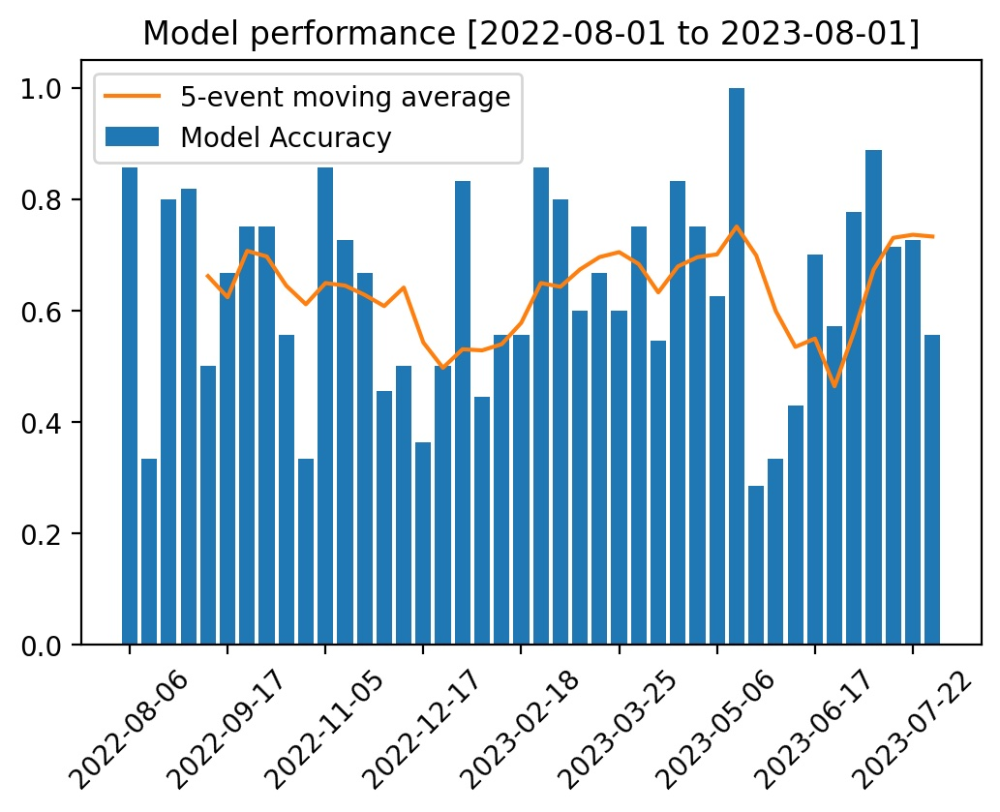
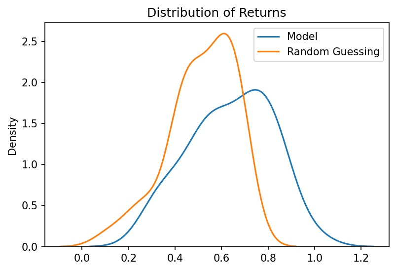

**UFBoost**

Some of the source code can be found in `main/src` however, this is mainly for evidential/sharing purposes and does not show all the model code/data/pipelines as these are currently private. 

See `main/test.sh` for how to execute backtests. 

**Results**
The below figures show some of the results of testing the model on each UFC event in the period 2022-08-01 to 2023-08-01, where accuracy scores are per-event. This is a nice way to treat the data as it allows us to assume these are independent events and can benchmark the performance against a binomial (n,0.5) random variable for each event. The results clearly show that the model is much better than a random yes/no for each fight on the card. 

At present, for this period, the model is less accurate than choosing the bookies favourite in each fight, however, doing this is clearly not a profitable strategy anyway. The model is able to often correctly identify and predict underdogs etc. 

